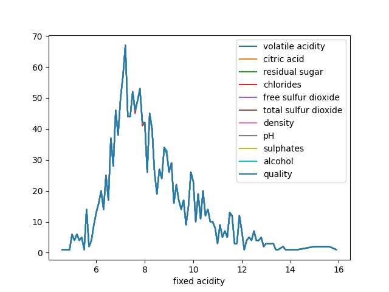
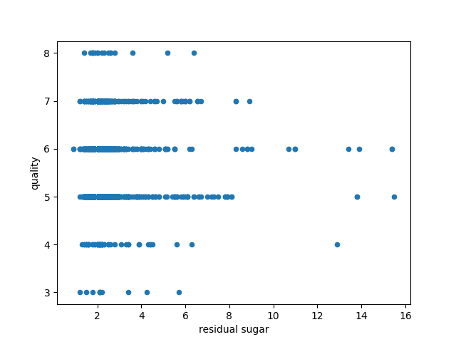
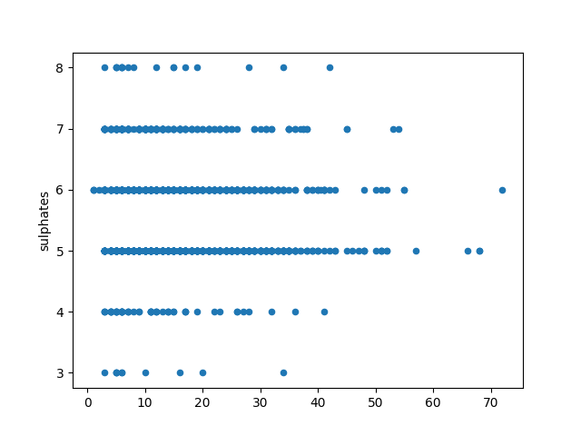

# REPORT ON GRAPHS AND PLOTS
---
## First plot
---

- The graph above gives an overview of the distribution of "fixed acidity" values in the dataset.
- The graph also counts all the same values in the "fixed acidity" dataset and displays it in a frequency form.

## Second plot
---
)
- The graph above is a scatter plot of "residual sugar" against "quality".
- It has it's xlabel as "residual sugar" and ylabel as "quality".

## Third plot
----

- The graph above is a scatter plot of "free sulphur dioxide" against "sulphates" which are attributes on the table.
- The graph has it's xlabel to be "free sulphur dioxide" and ylabel to be "sulphates".